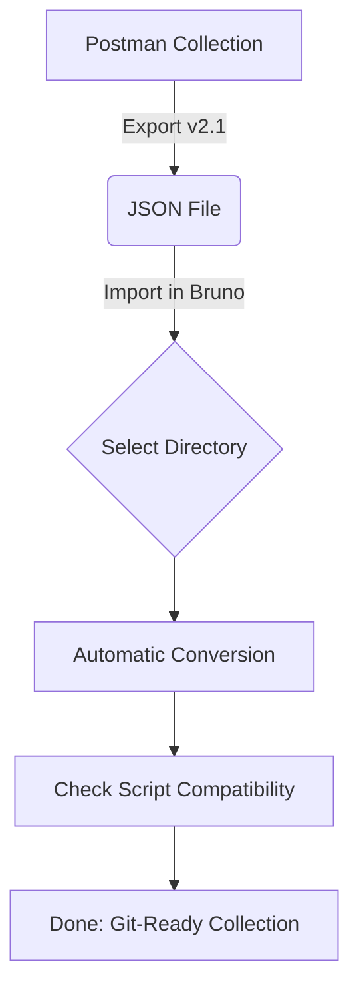

## 🚀 Bruno：現代化開源 API 協作工具方案

### 引言：打破雲端綁架，回歸 Git 驅動的開發體驗

在使用 API 開發工具時，您是否曾擔心資料被雲端平台綁架，或者難以進行版本控制？**Bruno** 是一個開源且強大的新型 API 客戶端工具 (API Client)，被廣泛視為 Postman 與 Insomnia 的最佳現代開源替代方案。它讓 API 的演進能與原始碼同步，實現真正的 **API-as-Code**。

---

### 📖 什麼是 Bruno？

Bruno 的核心哲學是與其強迫將資料儲存在雲端，不如選擇將 API 請求儲存為 **純文字檔案**（如 `.bru` 或 `.yml`）。這意味著您的 API 集合可以像程式碼一樣，直接放入 Git 倉庫中進行版控、分支管理與同儕審查 (Code Review)。

---

### 🛠️ 安裝指南 (macOS)

建議使用 Homebrew 安裝，方便日後透過指令一鍵更新所有開發工具：

```bash
# 使用 Homebrew 安裝
brew install bruno
```

當然，您也可以前往 [Bruno 官網](https://www.usebruno.com/) 下載安裝檔。

---

### 🔄 從 Postman 無痛轉移

> 📦 **預覽須知**：本圖使用 Mermaid 語法繪製。若在 VS Code 中看不到圖示，請安裝擴充套件 [Markdown Preview Mermaid Support](https://marketplace.visualstudio.com/items?itemName=bierner.markdown-mermaid)（搜尋 `bierner.markdown-mermaid`）後，重新開啟 Markdown Preview 即可正常顯示。



#### 腳本語法對照表 (Troubleshooting)

如果您原本在 Postman 有撰寫測試腳本，請參考下表進行微調：

| 功能            | Postman 語法                   | Bruno 語法                   |
| :-------------- | :----------------------------- | :--------------------------- |
| **獲取變數**    | `pm.environment.get("id")`     | `bru.getEnvVar("id")`        |
| **設定變數**    | `pm.environment.set("id", 1)`  | `bru.setEnvVar("id", 1)`     |
| **獲取 Body**   | `pm.response.json()`           | `res.getBody()`              |
| **獲取 Header** | `pm.response.headers.get("X")` | `res.getHeader("X")`         |
| **發送請求**    | `pm.sendRequest(...)`          | `await bru.sendRequest(...)` |

---

### 🤖 自動化測試與 CLI

Bruno 提供強大的 CLI 工具，讓 API 測試能輕鬆整合進 CI/CD 流程中：

```bash
# 安裝 CLI
npm install -g @usebruno/cli

# 執行單一測試
bru run Auth/Login.bru --env Local

# 執行全項目並產出 JUnit 報告
bru run --env Local --output results.xml --format junit
```

> [!IMPORTANT]
> 執行 `bru run` 時，路徑必須位於包含 `bruno.json` 的專案根目錄。

---

### 結語：開發者主權的回歸

Bruno 不僅是一個工具，更是一種對 **開發者主權** 的回歸。它讓 API 測試資料不再是孤島，而是與專案代碼並肩作戰的資產。對於重視資安、效能與版控準確性的開發團隊，Bruno 是絕對的首選。

歡迎前往 [chiisen/Bruno](https://github.com/chiisen/Bruno) 貢獻或獲取更多進階技巧！🚀✨

---

<!-- Badges -->


---
