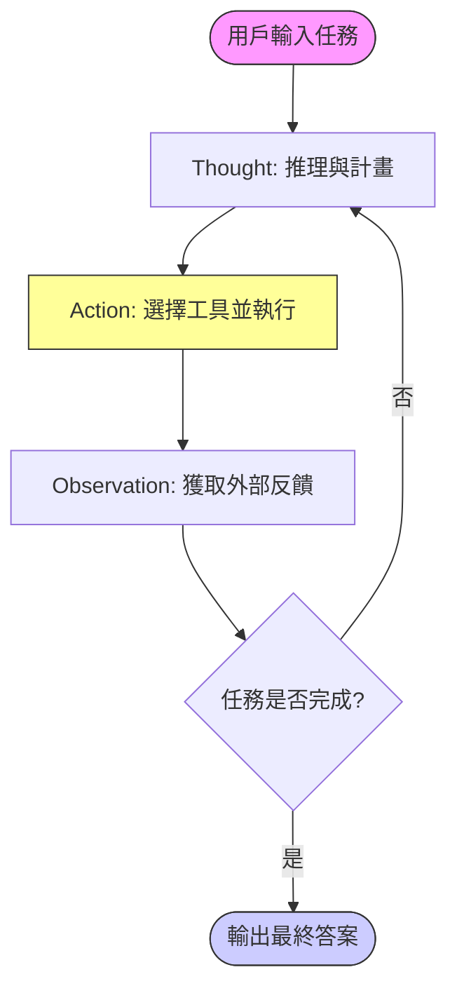

## 🤖 ReAct-Agent：結合「推理」與「行動」的 AI 代理框架

### 引言：讓 AI 像人類一樣思考與行動

**ReAct (Reasoning and Acting)** 是一個結合了「推理」與「行動」的 AI 代理框架，讓大語言模型 (LLM) 能夠像人類一樣解決複雜任務。本專案透過結合推理能力與工具調用，使 AI 不僅能提供文本解答，還能主動與外部環境互動以獲取資訊。

---

### 🎯 核心理念：T-A-O 循環

ReAct 的核心在於將執行的過程拆解為三個不斷循環的步驟：

1.  **Thought (推理)**：模型先解釋「為什麼」要這麼做。這能幫助模型拆解複雜問題並追蹤任務進度。
2.  **Action (行動)**：模型根據推理決定執行具體的動作（例如：調用搜尋引擎、查看文件、執行 Python 程式碼）。
3.  **Observation (觀察)**：執行動作後獲得的外部反饋。模型會根據這個觀察進入下一個思維循環。

---

### 🧩 技術選型：OpenAI SDK 介紹

本專案採用 `openai` 官方 Python SDK 來與 **MiniMax 國際版** 進行通訊。

雖然我們使用的是 MiniMax 的模型 (`Minimax-M2.5`)，但 MiniMax 提供了「OpenAI 兼容接口」。使用 SDK 的優點包括：

- **跨平台兼容**：未來若想切換到 GPT-4 或 Claude (經由 LiteLLM 等代理)，只需更改 `base_url` 與 `api_key`。
- **簡化開發**：自動處理 JSON 封裝與 HTTP Header，並提供完善的型別提示。
- **穩定性**：內建錯誤處理與連線管理。

---

### 📊 系統流程圖

> 📦 **預覽須知**：本圖使用 Mermaid 語法繪製。若在 VS Code 中看不到圖示，請安裝擴充套件 [Markdown Preview Mermaid Support](https://marketplace.visualstudio.com/items?itemName=bierner.markdown-mermaid)（搜尋 `bierner.markdown-mermaid`）後，重新開啟 Markdown Preview 即可正常顯示。



---

### 🚀 快速開始 (Quick Start)

本專案建議在 WSL (Ubuntu 22.04) 環境下運行。

1.  **環境準備**：確保系統已安裝 `python3-pip` 與 `python3-venv`。
2.  **建立虛擬環境與安裝依賴**：
    ```bash
    python3 -m venv .venv
    source .venv/bin/activate
    pip install -r requirements.txt
    ```
3.  **設定環境變數**：複製 `.env.example` 為 `.env` 並填入您的 MiniMax API Key (`MINIMAX_API_KEY`, `MINIMAX_BASE_URL=https://api.minimax.io/v1`, `MINIMAX_MODEL=Minimax-M2.5`)。
4.  **執行 Agent**：
    ```bash
    python3 main.py
    ```

---

### 結語：探索 AI 實作的新典範

ReAct Agent 提供了一個清晰且具體的框架，幫助開發者理解如何賦予大型語言模型使用工具的權力。如果您對建構更具主動性的 AI 助理感興趣，歡迎前往 [chiisen/ReAct-Agent](https://github.com/chiisen/ReAct-Agent) 參考源代碼並探索無限可能！🤖✨

---

<!-- Badges -->


---
