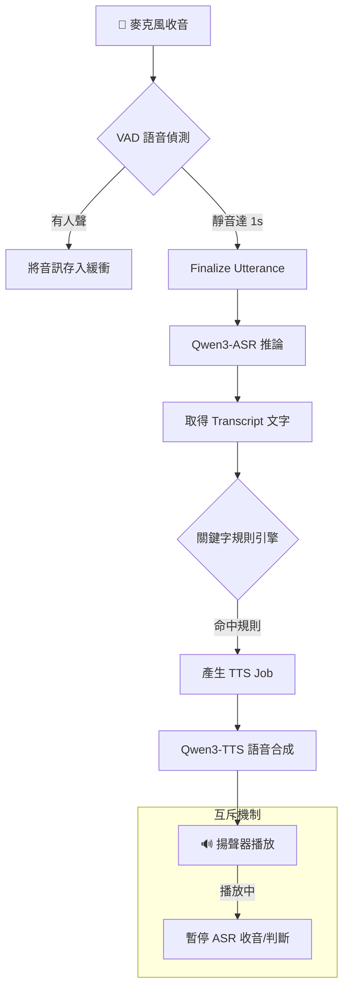

## 🎙️ 語音互動助理 (Voice-Activated Assistant)

### 引言：打造專屬的高效能語音助理

在隱私意識抬頭的時代，將所有的語音資料傳送至雲端處理已不再是唯一選擇。**語音互動助理** 是一個基於 Python 開發的高效能、隱私優先的本地端語音代理系統。透過整合最新的 Qwen3 ASR 與 TTS 技術，不僅能實現流暢的語音指令識別與自動化回應，更能確保您的每一句話都安全地留在本地設備上。

---

### ✨ 核心特性：流暢且安全的互動體驗

本專案在設計上兼顧了效能、隱私與互動流暢度：

1.  **🚀 極速本地推論**：使用 Qwen3-ASR 與 Qwen3-TTS，支援串流輸出，提供極低首包延遲。
2.  **🤫 隱私與安全**：語音轉文字 (ASR) 結果僅暫存於記憶體 (RAM)，程式結束後自動釋放，絕不留任何磁碟紀錄。
3.  **🧠 智慧停頓偵測 (VAD)**：內建 1.0 秒連續靜音判斷，精準識別一段話的結束點。
4.  **🚦 狀態機協調**：當 TTS 播放時自動暫停 ASR 監聽，完美解決「自己聽到自己講話」的自我回饋問題。
5.  **🛠️ JSON 驅動規則**：透過簡單的 JSON 設定檔定義關鍵字、優先序與多樣化的回覆模式。

---

### 🏗️ 技術架構與工作流程

系統採用多執行緒非同步設計，確保音訊採集與 AI 推論互不干擾。

> 📦 **預覽須知**：本圖使用 Mermaid 語法繪製。若在 VS Code 中看不到圖示，請安裝擴充套件 [Markdown Preview Mermaid Support](https://marketplace.visualstudio.com/items?itemName=bierner.markdown-mermaid)（搜尋 `bierner.markdown-mermaid`）後，重新開啟 Markdown Preview 即可正常顯示。

---

### 🛠️ 技術棧與開發計畫

本專案的核心基礎建設採用了當代領先的高效技術：

- **語言**: Python 3.10+
- **ASR**: Qwen3-ASR (1.7B)
- **TTS**: Qwen3-TTS
- **VAD**: Silero VAD
- **併發處理**: Threading + Python Queue

目前專案處於階段性開發中，核心架構與初步實作已具備雛形。未來我們將持續完善系統的各項模組，詳細的開發進度可追蹤倉庫中的 [專案待辦事項 (TODO.md)](https://github.com/chiisen/voice-activated-assistant.py/blob/main/TODO.md) 與 [產品需求文件 (PRD.md)](https://github.com/chiisen/voice-activated-assistant.py/blob/main/PRD.md)。

---

### 結語：本地端即時語音對話的未來

透過本地強大的開源模型與靈活的 Python 併發架構，我們能賦予個人電腦擁有專屬的智慧語音管家。無論是控制設備、查詢資訊，亦或是自動化您的工作流程，它都能夠在一聲令下為您服務。

歡迎前往 [chiisen/voice-activated-assistant.py](https://github.com/chiisen/voice-activated-assistant.py) 探索詳情並追蹤開發進度！🎤✨

---

<!-- Badges -->

---
